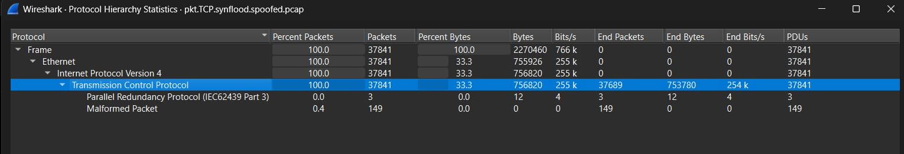
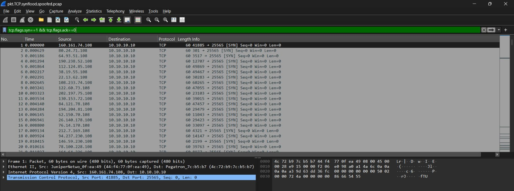
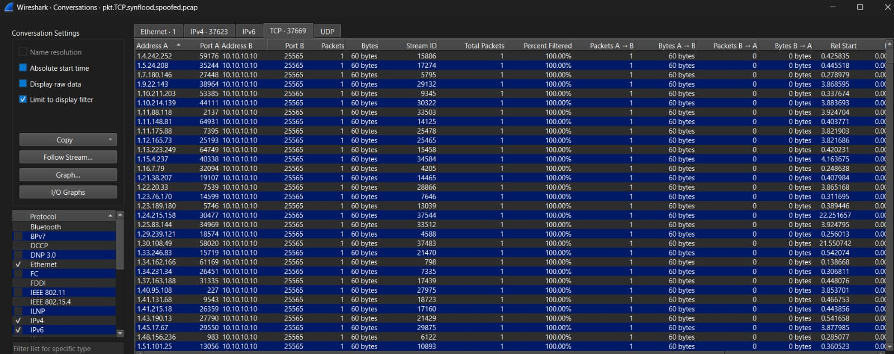
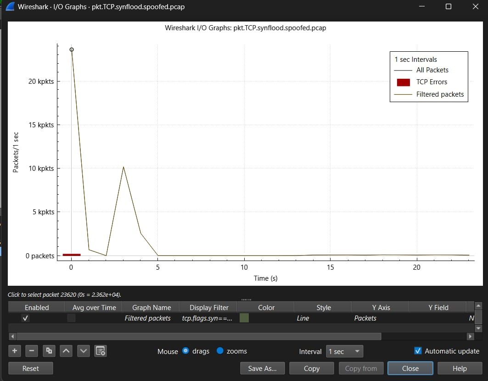

# Laporan Analisis PCAP - DDoS TCP SYN Flood

**Mata Kuliah:** Keamanan Jaringan Komputer (A) / Network Security (Praktik Keamanan Jaringan)
**Tugas:** PCAP Traffic Analysis Challenge with Wireshark - Week 3
**Kelompok:** 11
**Topik:** Botnet / DDoS

| No | Nama | NRP |
|----|------|-----|
| 1  | Sulthan Daffa Al Hasyimi | 5027251091 |
| 2  | Muhammad Yusuf | 5027251067 |
| 3  | Wildan Alfarezy | 5027251088 |

---

## 1. Pendahuluan

Laporan ini menganalisis satu file PCAP untuk mengidentifikasi jenis serangan jaringan yang terekam di dalamnya. Analisis dilakukan menggunakan Wireshark dengan memeriksa komposisi protokol, flag TCP, pola percakapan, dan grafik trafik.

- File yang dianalisis: `pkt.TCP.synflood.spoofed.pcap` (ukuran ~2,9 MB)
- Sumber: repositori publik StopDDoS/packet-captures (detail di `data/SUMBER.md`)
- Dugaan awal jenis serangan: DDoS TCP SYN Flood

---

## 2. Dasar Teori Singkat

- **TCP three-way handshake:** koneksi TCP normal dibentuk melalui urutan SYN -> SYN-ACK -> ACK.
- **SYN Flood:** penyerang membanjiri korban dengan paket SYN tetapi tidak pernah menyelesaikan handshake, sehingga koneksi setengah terbuka (half-open) menumpuk dan resource korban habis.
- **DoS vs DDoS:** DoS berasal dari satu sumber, sedangkan DDoS berasal dari banyak sumber menuju satu korban. Pembedanya ada pada jumlah sumber.
- **Kaitan ke topik Botnet:** botnet adalah kumpulan perangkat terinfeksi yang dikendalikan penyerang untuk melancarkan DDoS, salah satunya dengan membanjiri korban memakai trafik berlebihan. SYN Flood terdistribusi adalah bentuk banjir yang khas dilakukan botnet.

---

## 3. Metodologi

Langkah analisis yang dilakukan (lihat `analysis/PANDUAN-ANALISIS.md`):

1. Triage awal dengan `capinfos` dan menu Statistics.
2. Pemeriksaan komposisi protokol (Protocol Hierarchy).
3. Filter konfirmasi jenis serangan (flag TCP).
4. Pemeriksaan pola percakapan (Conversations).
5. Pemeriksaan pola trafik terhadap waktu (I/O Graph).
6. Pengambilan bukti berupa screenshot dan output tshark.

Tools: Wireshark 4.2.2, tshark, capinfos.

---

## 4. Temuan - Jenis Serangan: TCP SYN Flood (DDoS)

### 4.1 Analisis Protocol Hierarchy

Berdasarkan tampilan Protocol Hierarchy, seluruh paket pada file capture didominasi oleh protokol TCP yang berjalan di atas IPv4 dan Ethernet. Terlihat sebanyak 37.841 paket (100%) termasuk dalam kategori TCP. Tidak ditemukan penggunaan protokol aplikasi lain yang signifikan seperti HTTP, DNS, maupun UDP. Terdapat 149 paket (0,4%) yang ditandai malformed oleh Wireshark, namun paket tersebut tetap berada di dalam lapisan TCP dan tidak mengubah kesimpulan.

Dominasi penuh trafik TCP menunjukkan bahwa aktivitas yang terekam berfokus pada eksploitasi mekanisme komunikasi TCP. Temuan ini konsisten dengan karakteristik serangan TCP SYN Flood, di mana penyerang mengirimkan sejumlah besar paket SYN untuk memenuhi kapasitas koneksi pada server target.

**Kesimpulan:** Protocol Hierarchy menunjukkan bahwa serangan dilakukan menggunakan protokol TCP dan bukan melalui layanan lain seperti DNS atau UDP Amplification.

### 4.2 Analisis Filter TCP SYN

Hasil filtering menunjukkan seluruh paket yang ditampilkan memiliki flag [SYN] tanpa disertai flag ACK. Setiap paket memiliki panjang sekitar 60 byte dan dikirim menuju alamat tujuan 10.10.10.10 pada port 25565.

Selain itu terlihat bahwa alamat sumber terus berubah pada setiap paket, sedangkan alamat tujuan tetap sama. Kondisi ini menunjukkan adanya sejumlah besar sumber yang mengirimkan permintaan pembentukan koneksi TCP ke satu target yang sama.

Pada komunikasi TCP normal, paket SYN seharusnya diikuti oleh paket SYN-ACK dan ACK untuk membentuk koneksi yang valid. Namun pada capture ini hanya ditemukan paket SYN yang dikirim secara terus-menerus.

| Filter | Jumlah paket |
|---|---|
| `tcp.flags.syn==1 && tcp.flags.ack==0` | 37.841 |
| `tcp.flags.syn==1 && tcp.flags.ack==1` | 0 |

**Kesimpulan:** Pola paket yang hanya berisi flag SYN merupakan indikator kuat terjadinya serangan TCP SYN Flood yang bertujuan memenuhi tabel koneksi server dengan koneksi setengah terbuka (half-open connection).

### 4.3 Analisis Conversations

Pada menu Conversations terlihat banyak pasangan komunikasi yang mengarah ke alamat tujuan yang sama yaitu 10.10.10.10:25565. Setiap alamat sumber hanya mengirimkan satu paket TCP SYN dengan ukuran 60 byte dan tidak menerima balasan dari server.

Jumlah entri percakapan yang sangat besar (puluhan ribu) menunjukkan adanya ribuan alamat sumber yang berpartisipasi dalam pengiriman trafik ke satu korban. Pola komunikasi many-to-one seperti ini merupakan karakteristik utama serangan Distributed Denial of Service (DDoS).

Selain itu, tidak ditemukan adanya paket balasan dari sisi server yang menandakan bahwa proses three-way handshake tidak berhasil diselesaikan.

**Kesimpulan:** Analisis Conversations membuktikan bahwa serangan bersifat terdistribusi karena melibatkan banyak alamat sumber yang secara bersamaan menargetkan satu host tujuan.

### 4.4 Analisis I/O Graph

Grafik I/O menunjukkan lonjakan trafik yang sangat tinggi pada awal periode capture. Pada detik pertama jumlah paket mencapai lebih dari 20.000 paket per detik, kemudian menurun secara signifikan pada detik-detik berikutnya.

Pola ini menunjukkan adanya aktivitas burst traffic, yaitu pengiriman paket dalam jumlah besar dalam waktu yang sangat singkat. Karakteristik tersebut umum ditemukan pada serangan flooding yang bertujuan menghabiskan sumber daya server dalam waktu cepat.

Lonjakan trafik yang terpusat pada awal capture juga menunjukkan bahwa serangan dilakukan secara agresif dan terkoordinasi untuk memaksimalkan dampak terhadap layanan target.

**Kesimpulan:** I/O Graph memperlihatkan adanya banjir paket TCP SYN menuju target yang menyebabkan peningkatan trafik secara drastis, sehingga mendukung identifikasi serangan DDoS SYN Flood.

### Ringkasan Bukti Terverifikasi

| Metrik | Nilai |
|---|---|
| Total paket | 37.841 |
| Paket SYN (syn=1, ack=0) | 37.841 (100%) |
| Paket SYN-ACK (syn=1, ack=1) | 0 |
| IP sumber unik (spoofed) | 37.623 |
| Korban | 10.10.10.10 |
| Port target | 25565 |
| Ukuran paket | 60 byte |
| Puncak trafik | lebih dari 20.000 paket/detik di detik pertama |

---

## 5. Kesimpulan

Berdasarkan hasil analisis Protocol Hierarchy, TCP Flags, Conversations, dan I/O Graph, dapat disimpulkan bahwa file `pkt.TCP.synflood.spoofed.pcap` berisi serangan Distributed Denial of Service (DDoS) jenis TCP SYN Flood. Serangan dilakukan dengan mengirimkan paket SYN dalam jumlah sangat besar dari banyak alamat sumber menuju satu target yaitu 10.10.10.10 pada port 25565. Tidak ditemukannya proses three-way handshake yang lengkap menunjukkan adanya upaya menciptakan koneksi half-open untuk menghabiskan sumber daya server dan mengganggu ketersediaan layanan.

- **Jenis serangan:** DDoS TCP SYN Flood (spoofed).
- **Korban dan port:** 10.10.10.10 pada port 25565 (port default server Minecraft).
- **Sifat terdistribusi:** 37.623 alamat sumber palsu menuju satu korban (pola many-to-one).
- **Klasifikasi:** DDoS berbasis protokol / state exhaustion (Layer 4), bukan amplifikasi. Persamaan dengan serangan amplifikasi hanya pada teknik IP spoofing.
- **Tingkat keyakinan:** tinggi, didukung empat bukti yang saling menguatkan.

---

## 6. Mitigasi

- **SYN Cookies:** server tidak menyimpan state koneksi sampai handshake benar-benar selesai.
- **Backlog tuning dan timeout:** memperkecil waktu tunggu koneksi half-open.
- **Rate limiting / firewall filtering:** membatasi laju paket SYN per sumber.
- **Anti-spoofing (ingress filtering / BCP38):** memblokir paket dengan IP sumber palsu di sisi jaringan.
- **Layanan mitigasi DDoS / reverse proxy:** menyerap trafik sebelum sampai ke server asal.

---

## 7. Referensi

- File PCAP: StopDDoS/packet-captures - https://github.com/StopDDoS/packet-captures
- Materi kelas: 03 Common Network Attacks (Week 3)
- Wikipedia: SYN flood
- Imperva: SYN Flood Mitigation Techniques
